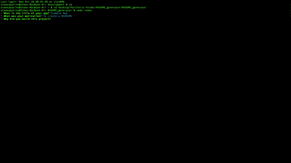

# README Generator

  ## Licensing:
  [](https://opensource.org/licenses/Apache-2.0)<br>
  <h3>Apache 2.0</h3>
  TERMS AND CONDITIONS FOR USE, REPRODUCTION, AND DISTRIBUTION

      1. Definitions.
      
      "License" shall mean the terms and conditions for use, reproduction, and distribution as defined by Sections 1 through 9 of this document.
      
      "Licensor" shall mean the copyright owner or entity authorized by the copyright owner that is granting the License.


  ## Table of Contents
  - [Description](#description)
  - [Installation](#installation)
  - [Usage](#usage)
  - [Contribution](#contribution)
  - [Testing](#testing)
  - [Additional Info](#additional-info)

  ## Description:

  

  I am making a readme two times a week, it takes a long time and looks different everytime.
  I wanted to make an app that can standardize my readmes and will be able to be made quick
  Making readmes that do not look professional
  How to use inquirer, switch cases, gitignores, arrow functions

    * writeToFile arrow function 
    ```
    function writeToFile(fileName, data) {
      // makes file, if error occurs than console.log the error
      fs.writeFile(fileName, data, (err) => {
          err ? console.log(err) : console.log("Success! A new README has been generated")
      })

    }
    ```
    * switch case
    ```
    function renderLicenseLinkBadge(license) {
    switch (license) {
      case "Apache 2.0":
        return `[](https://opensource.org/licenses/Apache-2.0)`
      case "IBM":
        return `[](https://opensource.org/licenses/IPL-1.0)`
      case "MIT":
        return `[](https://opensource.org/licenses/MIT)`
      case "Mozilla":
        return `[](https://opensource.org/licenses/MPL-2.0)`
      }
    }
    ```

  ## Installation:
  pull from github and download inquirer

  ## Usage:
  cd into the path of the folder and run node index on your terminal

  ## Contribution:
  Use github and add features
  
  ## Testing:
  test the app on your computer using your terminal

  ## Additional Info
  - Github: [stewsabatino](https://github.com/stewsabatino)
  - Email: stewsabatino@gmail.com
  
  